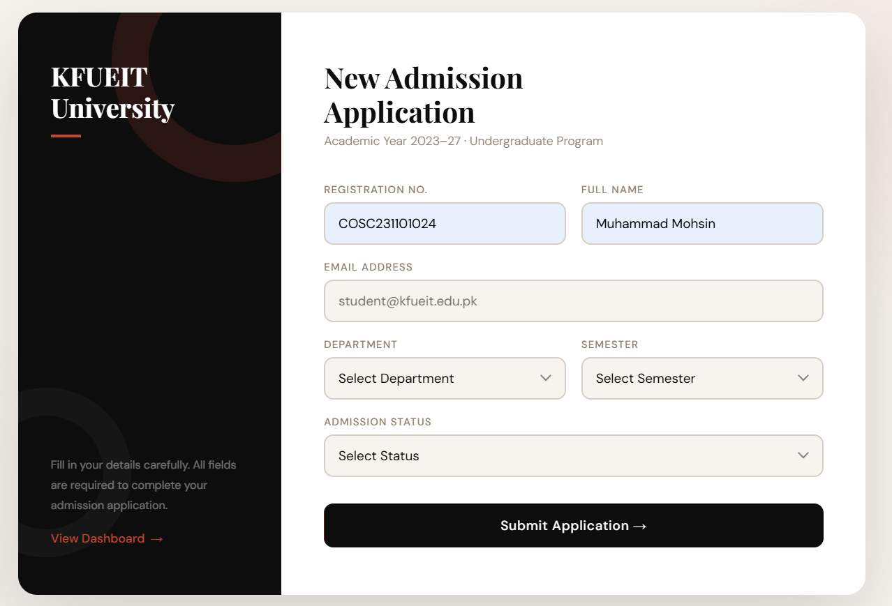

# Lab4 — Student Records System


## Project Overview

This project is a session-based Student Records Management System developed as part of the **Web Technologies** course at **KFUEIT University**. It allows an admin to manage student admission records through a clean, modern interface — supporting adding, viewing, editing, and deleting student entries without the need for a database, using PHP sessions for temporary storage.




The system is split into two pages: a student **Admission Form** (`index.php`) and an **Admin Dashboard** (`records.php`) that handles all CRUD operations through a single unified URL-parameter-based action handler.

---

## Features

- **Add Student** — Submit a new admission application via a structured form
- **View Records** — Dashboard table displaying all enrolled students with live stats (Total, Active, Graduated)
- **Edit Record** — Click Edit to navigate to `?action=edit&index=N`, which reveals an inline pre-filled edit form on the same page
- **Delete Record** — Click Delete to navigate to `?action=delete&index=N` with a confirmation prompt before removal
- **Single Action Handler** — All CRUD operations (insert, update, delete) are routed through one clean `switch($action)` block in `records.php`

- **Toast Notifications** — Success, warning, and error alerts shown as animated toasts after every action
- **Status Badges** — Students display color-coded status pills (Active, Pending, Graduated)
- **Responsive Design** — Mobile-friendly layout using CSS Grid and Flexbox

---

## Technologies Used

| Technology | Purpose |
|---|---|
| PHP 8+ | Backend logic, session handling, CRUD operations |
| HTML5 | Page structure and forms |
| CSS3 | Styling, animations, responsive layout |
| PHP Sessions | Temporary data storage (no database required) |
| Google Fonts | Playfair Display + DM Sans typography |

---

## How to Run / Setup

**Requirements:**
- XAMPP, WAMP, or any local PHP server (PHP 8.0+)
- A modern web browser

**Steps:**

1. Clone or download this repository into your server's root directory:
   ```
   /xampp/htdocs/Web-Programming-Projects/Lab4-CRUD/
   ```

2. Start **Apache** from your XAMPP/WAMP control panel.

3. Open your browser and navigate to:
   ```
   http://localhost/Web-Programming-Projects/Lab4-CRUD/index.php
   ```

4. Fill in the admission form and submit — you will be redirected to the dashboard at `records.php` automatically.

5. Use the **Edit** and **Delete** buttons on the dashboard to manage records. Notice the action and index reflected in the URL:
   ```
   records.php?action=edit&index=0
   records.php?action=delete&index=0
   ```


---

## Demo Video

> 🎬 **[Click here to watch the demo](https://drive.google.com/file/d/11L6cW_ao7cV_YKqY4cGkEMo1zYiNPo6i/view?usp=sharing)**  
