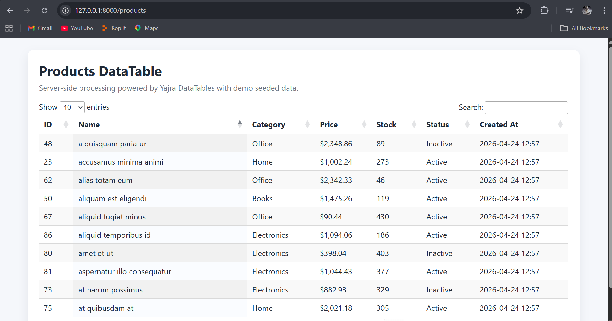

# Laravel 12 App with Yajra DataTables (Server-Side)

## Project Overview

This project is a simple Product Listing application built with Laravel 12 and **Yajra DataTables**.

It demonstrates server-side DataTables processing with searchable, sortable, and paginated product data using a seeded demo dataset.



### Implemented Specifications

- Yajra DataTables integration in Laravel
- Server-side DataTables endpoint for products
- Demo product model, migration, factory, and seeder
- 100 seeded demo records for testing
- Product list UI rendered in Blade using DataTables (jQuery CDN)
- Root route redirected to products table page

---

## Features

| Feature | Description |
|---|---|
| Server-side DataTable | Sorting, searching, pagination powered by Yajra |
| Demo Dataset | ProductSeeder inserts 100 product rows |
| Dynamic JSON Endpoint | `/products/data` returns DataTables JSON format |
| Product Listing UI | Table page at `/products` with DataTables JS |
| Clean Route Setup | Root `/` redirects to products listing |

---

## Tech Stack

- PHP 8.2+
- Laravel 12.x
- yajra/laravel-datatables-oracle v12.7
- MySQL / MariaDB
- jQuery DataTables (CDN)

---

## Installation

1. Clone repository:

```bash
git clone https://github.com/mohsinwarind/Web-Programming-Projects.git
cd Yajra-Lab7
```

2. Install dependencies:

```bash
composer install
npm install
```

3. Configure environment:

```bash
cp .env.example .env
php artisan key:generate
```

4. Update database credentials in `.env`:

```env
DB_CONNECTION=mysql
DB_HOST=127.0.0.1
DB_PORT=3306
DB_DATABASE=your_database_name
DB_USERNAME=root
DB_PASSWORD=
```

5. Run migration + seed demo data:

```bash
php artisan migrate --seed
```

6. Start app:

```bash
php artisan serve
```

---

## Routes

- Home redirect: `GET /` -> redirects to `/products`
- Products page: `GET /products`
- DataTables JSON: `GET /products/data`

---

## Data Schema (Products)

The products table includes:

- `id`
- `name`
- `category`
- `price`
- `stock`
- `is_active`
- `created_at`
- `updated_at`

---

## Key Files

```text
app/Http/Controllers/ProductController.php
app/Models/Product.php

database/factories/ProductFactory.php
database/migrations/2026_04_24_000003_create_products_table.php
database/seeders/ProductSeeder.php
database/seeders/DatabaseSeeder.php

resources/views/products/index.blade.php
routes/web.php
```

---

## How to Test DataTables

1. Open `/products` in browser.
2. Try search, column sorting, and pagination.
3. Verify server-side response from `/products/data`.

---

## Troubleshooting

If DataTables shows Ajax error:

1. Clear caches:

```bash
php artisan optimize:clear
```

2. Restart local PHP server / Apache.
3. Check Laravel logs at `storage/logs/laravel.log`.

---

## Author

- **Name:** Muhammad Mohsin
- **Roll No:** COSC231101024
