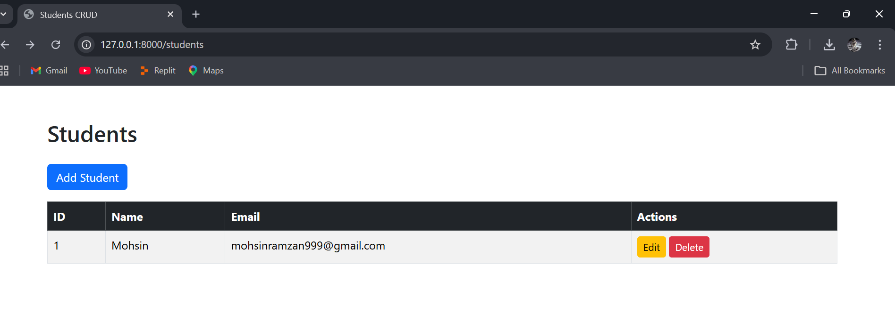
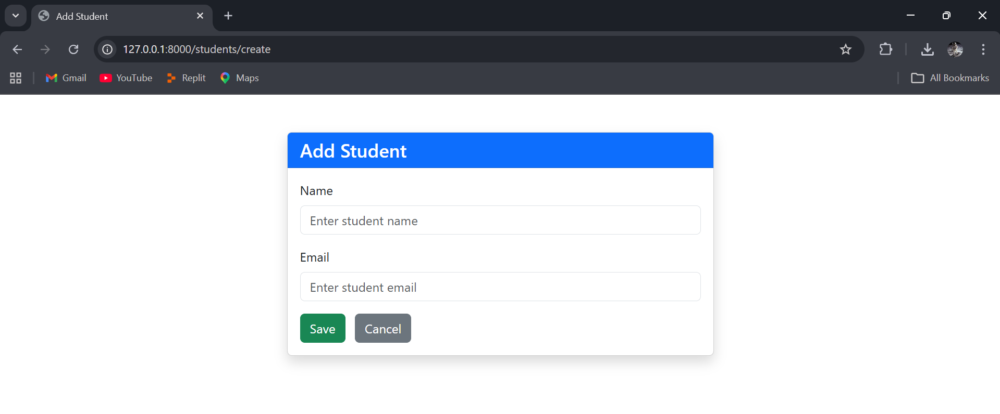
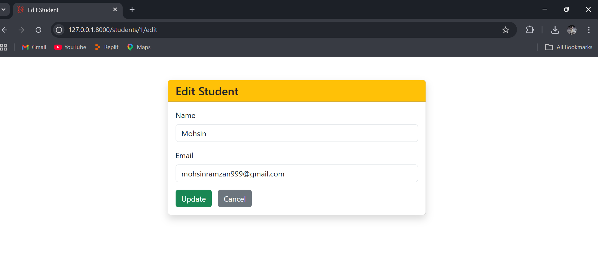

---

# Laravel CRUD Application


## 🔹 Project Overview

This is a simple **CRUD (Create, Read, Update, Delete) application** built using **Laravel 12** and **Bootstrap 5**.
The application allows users to manage student records with the following features:

* Add new students
* View all students
* Edit existing students
* Delete students
* Validation for required fields and proper email format
* Responsive design using Bootstrap

---

## 🔹 Features

| Feature       | Description                              |
| ------------- | ---------------------------------------- |
| Create        | Add new student with Name and Email      |
| Read          | List all students in a clean table       |
| Update        | Edit student details                     |
| Delete        | Remove a student with confirmation       |
| Responsive UI | Clean interface using Bootstrap 5        |
| Validation    | Ensures required fields and unique email |

---

## 🔹 Screenshots

### 1. Index Page


### 2. Add Student Page



### 3. Edit Student Page



---

## 🔹 Installation

1. **Clone the repository:**

```bash
git clone https://github.com/mohsinwarind/Web-Programming-Projects.git
cd laravel-crud-app
```

2. **Install dependencies:**

```bash
composer install
```

3. **Set up environment file:**

```bash
cp .env.example .env
```

4. **Configure database** in `.env`:

```
DB_CONNECTION=mysql
DB_HOST=127.0.0.1
DB_PORT=3306
DB_DATABASE=crud_app
DB_USERNAME=root
DB_PASSWORD=
```

5. **Generate application key:**

```bash
php artisan key:generate
```

6. **Run migrations:**

```bash
php artisan migrate
```

7. **Start the server:**

```bash
php artisan serve
```

8. **Open in browser:**

```
http://127.0.0.1:8000/students
```

---

## 🔹 Dependencies

* PHP 8.2+
* Laravel 12.56.0
* MySQL / MariaDB
* Composer
* Bootstrap 5 (via CDN)

---

## 🔹 Folder Structure (Key Files)

```
resources/views/students/
    ├── index.blade.php
    ├── create.blade.php
    └── edit.blade.php
app/Http/Controllers/StudentController.php
app/Models/Student.php
database/migrations/2026_04_04_XXXX_create_students_table.php
routes/web.php
```

---

## 🔹 Author

**Name : Muhammad Mohsin**
<br>
**Roll No:** COSC231101024


