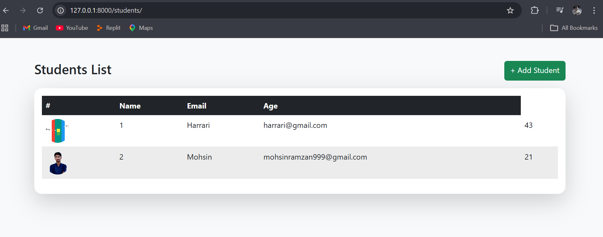
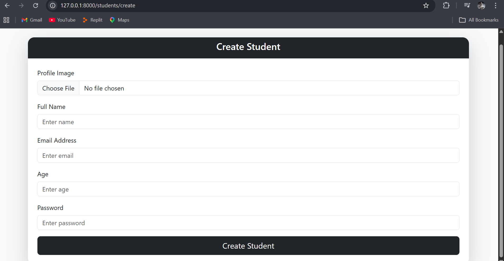

# Laravel App Implementing Validation and Broadcasting Application

🔹 **Project Overview**  
This is a simple Student Management application built using **Laravel 12** and **Bootstrap 5** and it allows the users to have the following features:


- Add new students with profile image upload  
- View all students in a pagelike index  
- Server-side validation for required fields, email format, and constraints  
- Image storage and validation using Laravel’s filesystem  
- Responsive layout using Bootstrap 5  
- Basic event broadcasting support integrated at the framework level

---

🔹 **Features**

| Feature        | Description                                              |
|---------------|----------------------------------------------------------|
| Create        | Add a new student with Name, Email, Age, Password, Image |
| Read          | List all students in a clean, responsive table           |
| Responsive UI | Clean interface built with Bootstrap 5                   |
| Validation    | Required fields, unique email, image type/size checks    |
| Broadcasting  | Laravel broadcasting stack available for real‑time events |

---

🔹 **Screenshots**

1. **Index Page**  
   – Students listing with ID, Name, Email, Age, and profile image.

   

2. **Add Student Page**  
   – Form to create a new student with validation errors shown neatly.
   


---

🔹 **Installation**

1. **Clone the repository:**
   ```bash
   git clone https://github.com/mohsinwarind/Web-Programming-Projects.git
   cd student-validation-Lab6
   ```

2. **Install dependencies:**
   ```bash
   composer install
   npm install   # optional, if you want to recompile assets
   ```

3. **Set up environment file:**
   ```bash
   cp .env.example .env
   ```

4. **Configure database in .env:**
   ```env
   DB_CONNECTION=mysql
   DB_HOST=127.0.0.1
   DB_PORT=3306
   DB_DATABASE=student_db
   DB_USERNAME=root
   DB_PASSWORD=
   ```

5. **Generate application key:**
   ```bash
   php artisan key:generate
   ```

6. **Run migrations:**
   ```bash
   php artisan migrate
   ```

7. **Link storage for images:**
   ```bash
   php artisan storage:link
   ```

8. **Start the development server:**
   ```bash
   php artisan serve
   ```

9. **Open in browser:**
   - Home page: `http://127.0.0.1:8000/`  
   - Students index: `http://127.0.0.1:8000/students`

---

🔹 **Dependencies**

- PHP 8.2+  
- Laravel 12.x  
- MySQL / MariaDB  
- Composer  
- Node.js & NPM (for frontend build, optional)  
- Bootstrap 5 (via CDN)

---

🔹 **Folder Structure (Key Files)**

```text
resources/views/students/
    ├── index.blade.php    # List all students
    └── create.blade.php   # Create new student form

app/Http/Controllers/StudentController.php
app/Models/Student.php
database/migrations/2026_04_08_045844_create_students_table.php
database/migrations/2026_04_08_053439_add_image_to_students_table.php
routes/web.php
```

---

🔹 **Author**

- **Name:** Muhammad Mohsin  
- **Roll No:** COSC231101024  

---
